# SQL-Island

SQL Island is a fun introduction to learning and using SQL. The challenge can be solved on this website: <a href="https://sql-island.informatik.uni-kl.de/" target="_blank">SQL ISLAND</a>

This is my approach to solving the SQL Island challenge.

---

### **QUESTION 01:**

It seems there are a few people living in these villages. How can I see a list of all inhabitants?
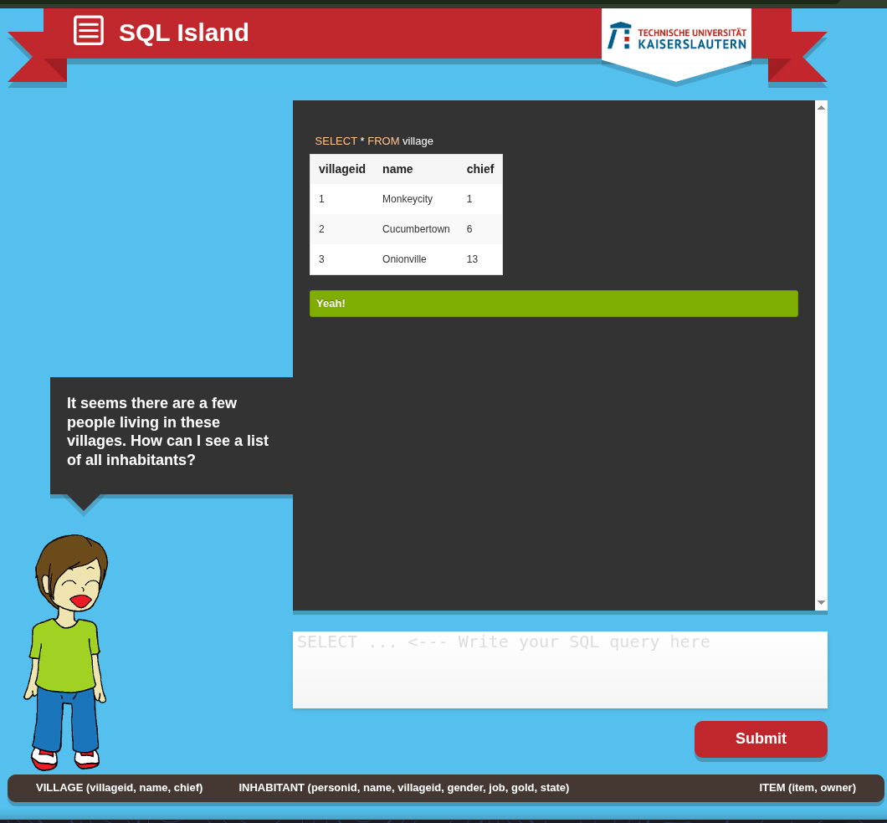

**Solution 01:**

```sql
SELECT * FROM INHABITANT;
```

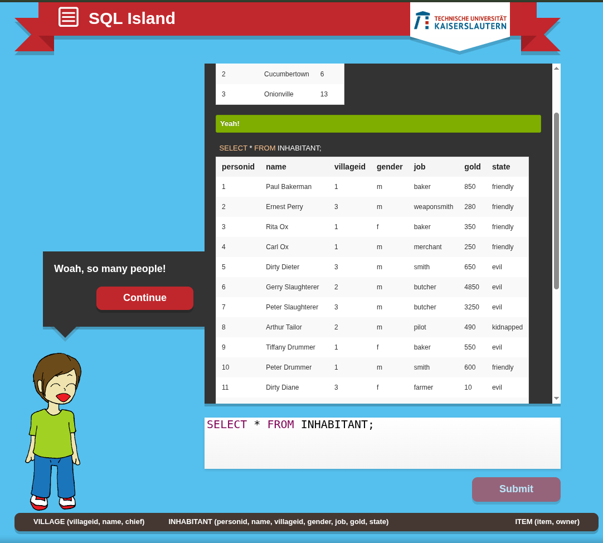

---

### **QUESTION 02:**

Thank you, Edward! Okay, let's see who is friendly on this island...


**Solution 02:**

```sql
SELECT * FROM INHABITANT WHERE state = 'friendly';
```

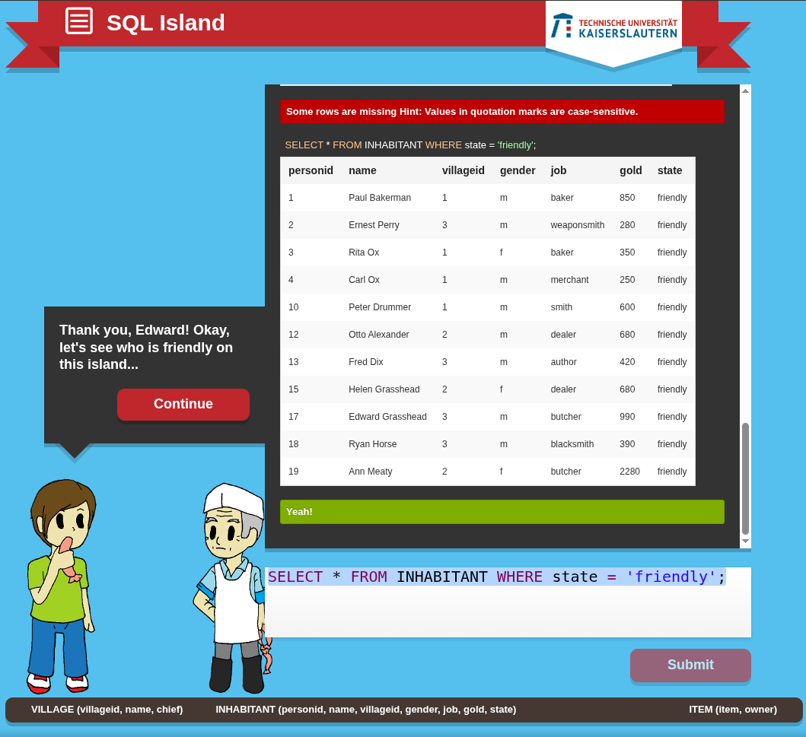

---

### **QUESTION 03:**

There is no way around getting a sword for myself. I will now try to find a friendly weaponsmith to forge me one. (Hint: You can combine predicates in the WHERE clause with AND)

**Solution 03:**

```sql
SELECT * FROM INHABITANT WHERE job = 'weaponsmith' AND state = 'friendly';
```

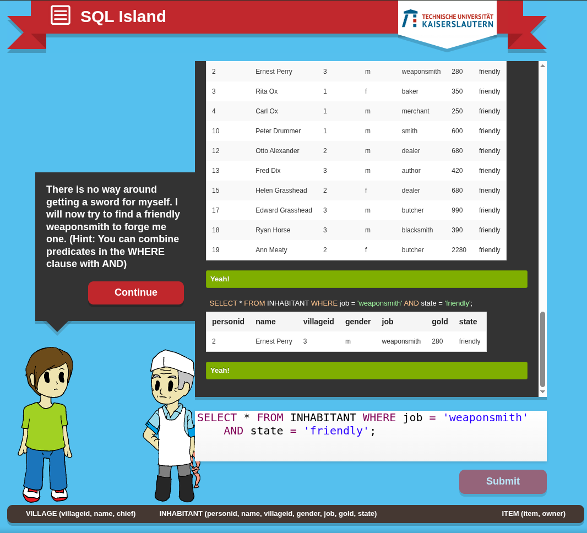

---

### **QUESTION 04:**

Oh, that does not look good. Maybe other friendly smiths can help you out, e.g. a blacksmith. Try out: `job LIKE '%smith'` to find all inhabitants whose job ends with 'smith'.

**Solution 04:**

```sql
SELECT * FROM INHABITANT WHERE job LIKE '%smith' AND state = 'friendly';
```

---

### **QUESTION 05:**

No need to call me stranger! What's my personid? (Hint: Use a SELECT query without an asterisk. In former queries, the \* stands for: all columns. Instead of the star, you can also address one or more columns (seperated by a comma) and you will only get the columns you need.)

**Solution 05:**

```sql
SELECT personid FROM INHABITANT WHERE name = 'Stranger';
```

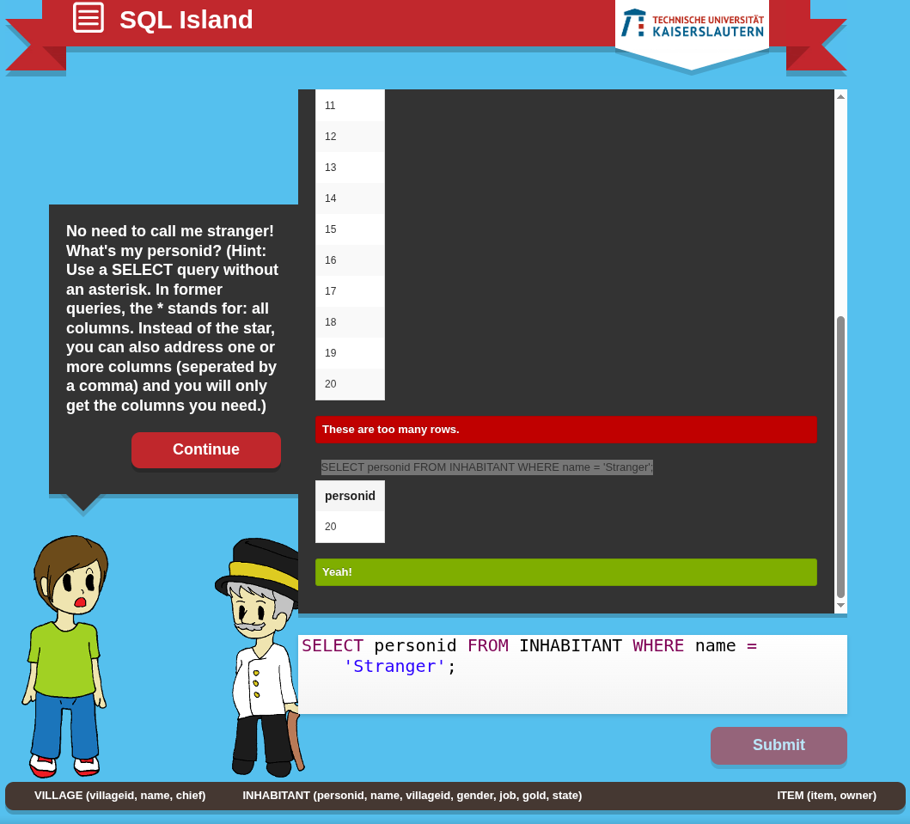

---

### **QUESTION 06:**

I can offer to make you a sword for 150 gold. That's the cheapest you will find! How much gold do you have?

**Solution 06:**

```sql
SELECT gold FROM INHABITANT WHERE name = 'Stranger';
```

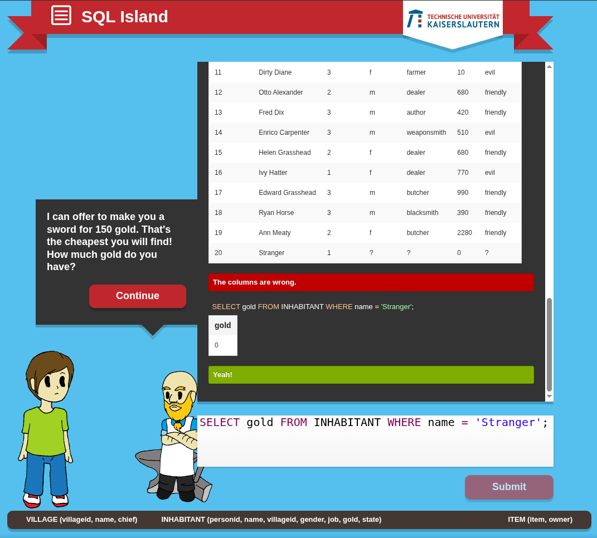

---

### **QUESTION 07:**

Damn! No mon, no fun. There has to be another option to earn gold other than going to work. Maybe I could collect ownerless items and sell them! Can I make a list of all items that don't belong to anyone?

**Solution 07:**

```sql
SELECT * FROM ITEM WHERE owner ISNULL;
```

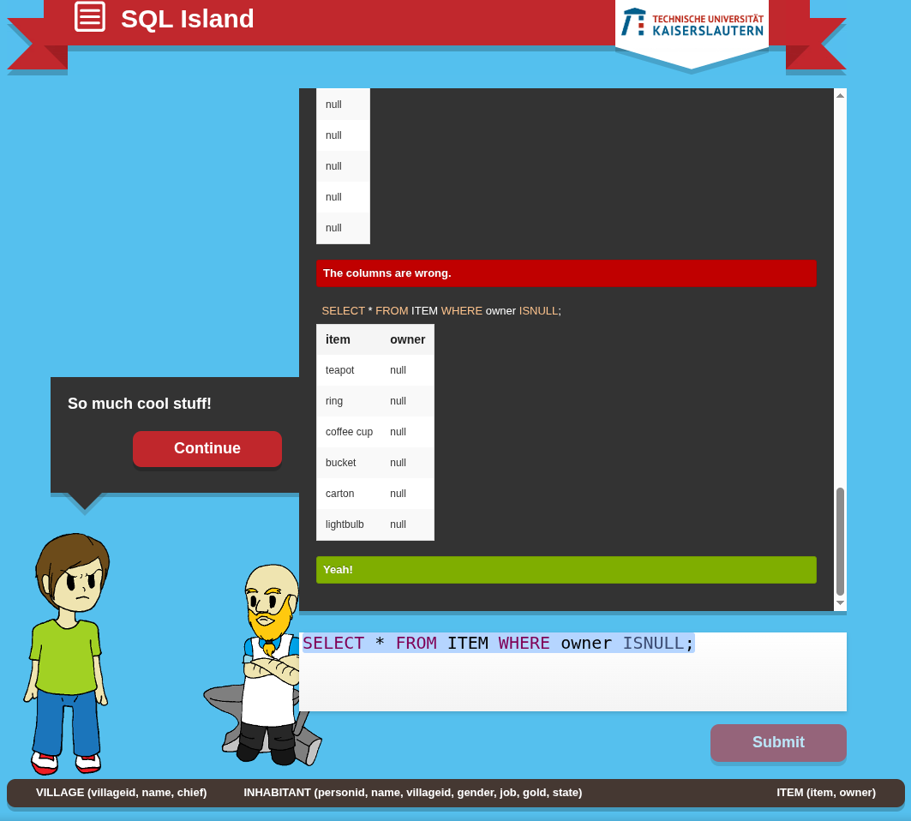

---

### **QUESTION 08:**

Do you know a trick how to collect all the ownerless items?

**Solution 08:**

```sql
UPDATE ITEM SET owner = '20' WHERE owner ISNULL;
```

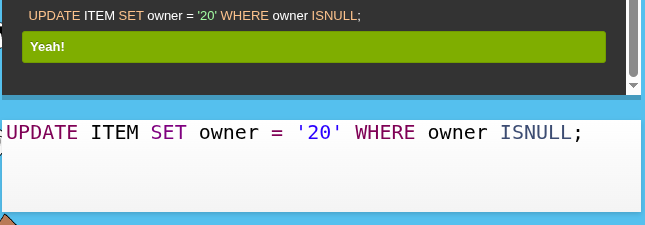

---

### **QUESTION 09:**

Now list all of the items I have!

**Solution 09:**

```sql
SELECT * FROM ITEM WHERE owner = '20';
```

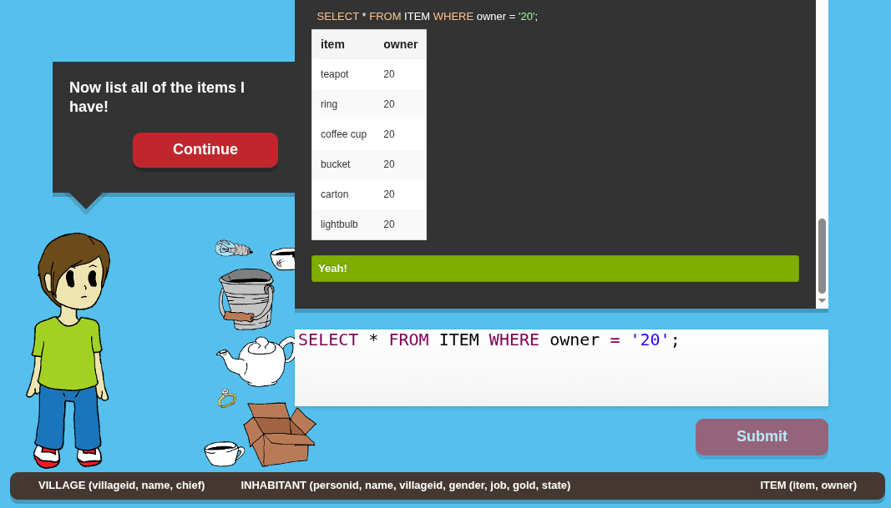

---

### **QUESTION 10:**

Find a friendly inhabitant who is either a dealer or a merchant. Maybe they want to buy some of my items. (Hint: When you use both AND and OR, don't forget to put brackets correctly!)

**Solution 10:**

```sql
SELECT * FROM INHABITANT WHERE (job = 'dealer' OR job = 'merchant') AND state = 'friendly';
```

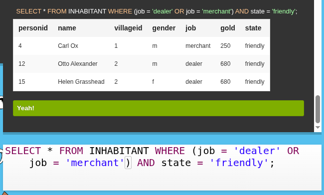

---

### **QUESTION 11:**

I'd like to get the ring and the teapot. The rest is nothing but scrap. Please give me the two items. My personid is 15.

**Solution 11:**

```sql
UPDATE ITEM SET owner = 15 WHERE item IN ('ring','teapot');
```

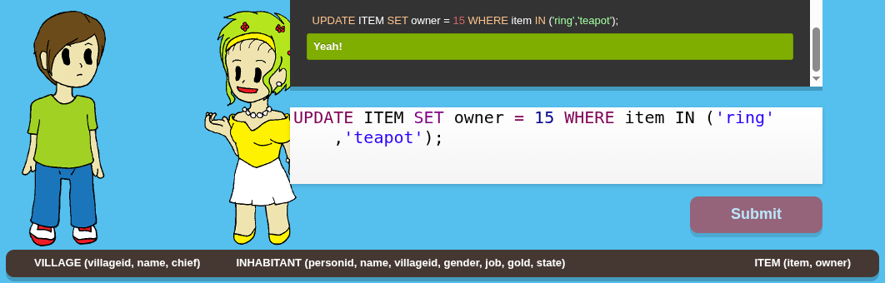

---

### **QUESTION 12:**

Unfortunately, that's not enough gold to buy a sword. Seems like I do have to work after all. Maybe it's not a bad idea to change my name from Stranger to my real name before I will apply for a job.

**Solution 12:**

```sql
UPDATE INHABITANT SET name = 'Ahmed' WHERE personid = 20;
```

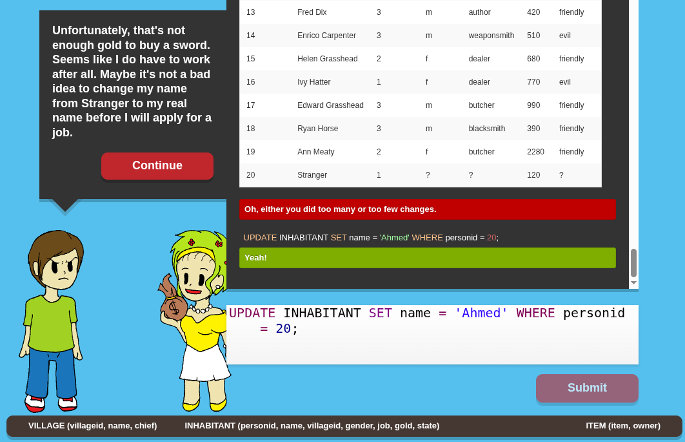

---

### **QUESTION 13:**

Since baking is one of my hobbies, why not find a baker who I can work for? (Hint: List all bakers and use 'ORDER BY gold' to sort the results. 'ORDER BY gold DESC' is even better because then the richest baker is on top.)

**Solution 13:**
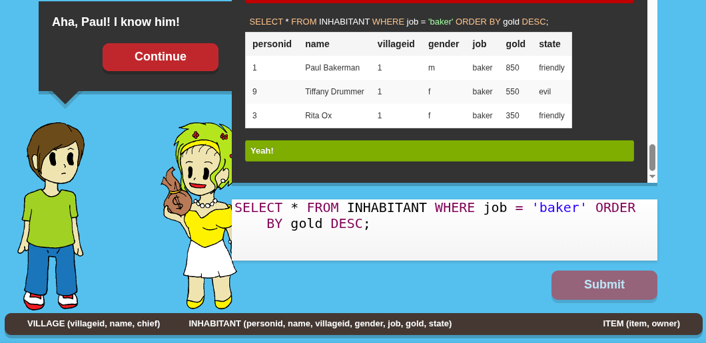

---

### **QUESTION 14:**

Is there a pilot on this island by any chance? He could fly me home.

**Solution 14:**

```sql
SELECT * FROM INHABITANT WHERE job = 'pilot';
```

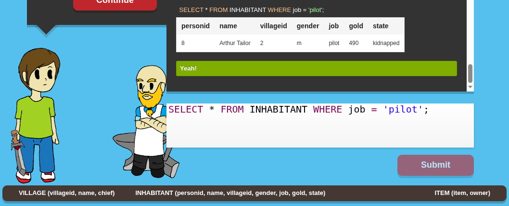

---

### **QUESTION 15:**

Horrible, the pilot is held captive by Dirty Dieter! I will show you a trick how to find out the name of the village where Dirty Dieter lives. Thanks for the hint! I can use the join to find out the chief's name of the village Onionville. (Hint: In the column 'chief' in the village table, the personid of the chief is stored)

**Solution 15:**

```sql
SELECT INHABITANT.name FROM VILLAGE, INHABITANT
ON VILLAGE.villageid = INHABITANT.villageid
WHERE VILLAGE.name = 'Onionville'
AND INHABITANT.personid = VILLAGE.chief;
```

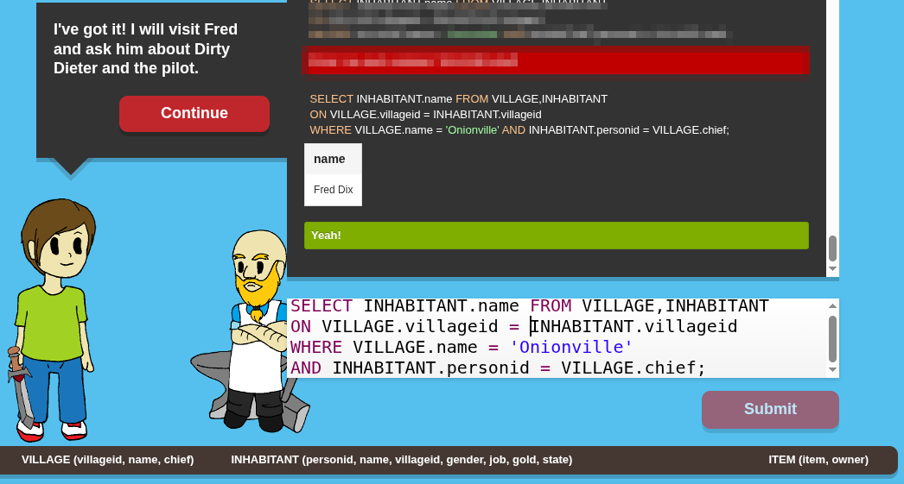

---

### **QUESTION 16:**

Hello Ahmed, the pilot is held captive by Dirty Dieter in his sister's house. Shall I tell you how many women there are in Onionville? Nah, you can figure it out by yourself! (Hint: Women show up as gender = 'f')

**Solution 16:**

```sql
SELECT COUNT(*) FROM VILLAGE, INHABITANT
ON VILLAGE.villageid = INHABITANT.villageid
WHERE VILLAGE.name = 'Onionville' AND INHABITANT.gender = 'f';
```

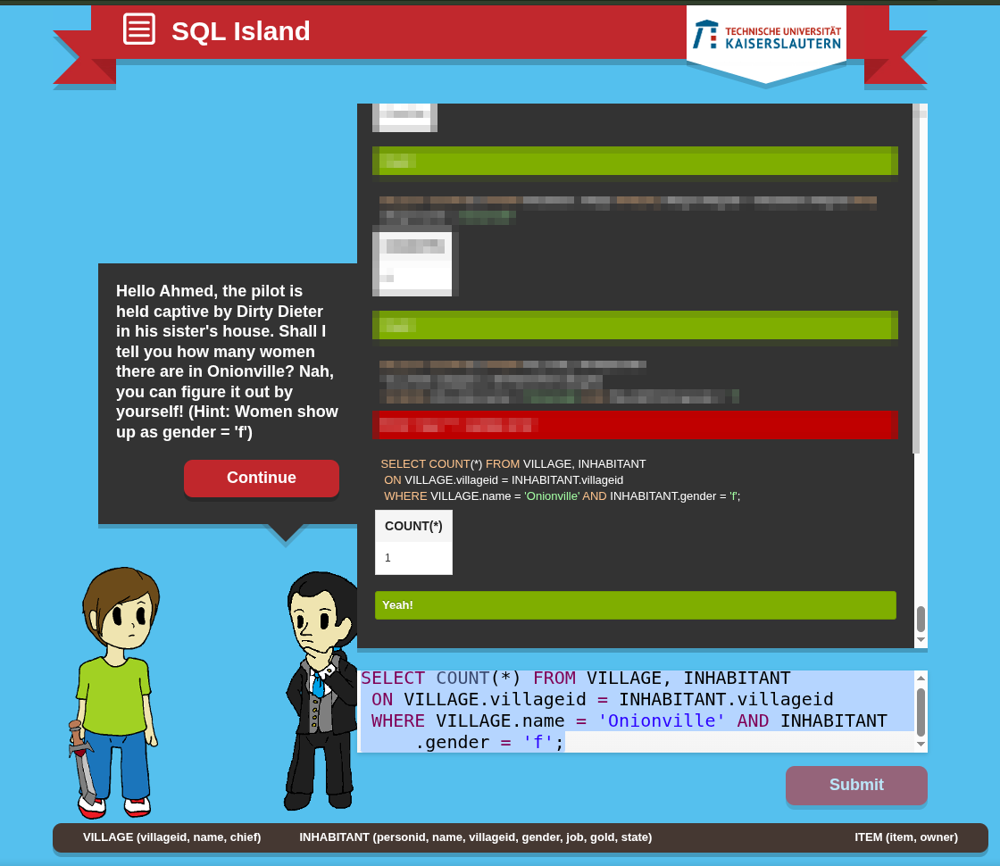

---

### **QUESTION 17:**

Oh, only one woman. What's her name?

**Solution 17:**

```sql
SELECT INHABITANT.name FROM VILLAGE, INHABITANT
ON VILLAGE.villageid = INHABITANT.villageid
WHERE VILLAGE.name = 'Onionville' AND INHABITANT.gender = 'f';
```

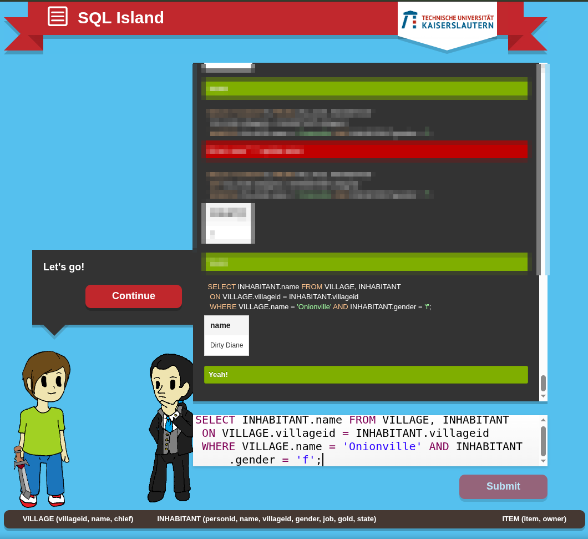

---

### **QUESTION 18:**

Ahmed, if you hand me over the entire property of our nearby village Cucumbertown, I will release the pilot. I will show you now what this property consists of.

**Solution 18:**

```sql
SELECT SUM(inhabitant.gold) FROM inhabitant, village
WHERE village.villageid = inhabitant.villageid
AND village.name = 'Cucumbertown';
```

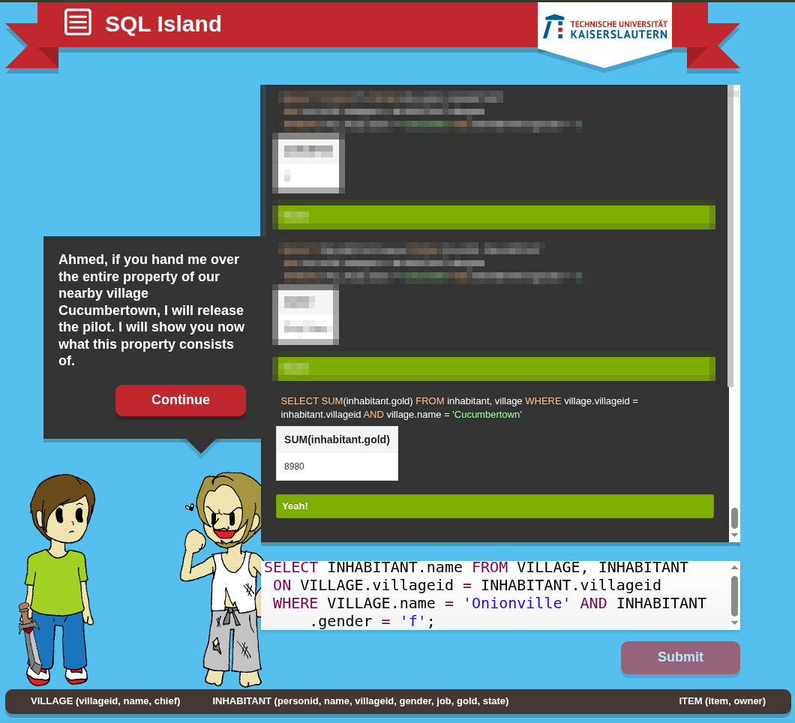

---

### **QUESTION 19:**

Oh no, baking bread alone can't solve my problems. If I continue working and selling items though, I could earn more gold than the worth of gold inventories of all bakers, dealers and merchants together. How much gold is that?

**Solution 19:**

```sql
SELECT SUM(gold) FROM INHABITANT
WHERE job = 'baker' OR job = 'dealer' OR job = 'merchant';
```

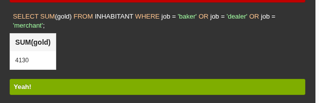

---

### **QUESTION 20:**

For some reason, butchers own the most gold. How much gold do different inhabitants have on average, depending on their state (friendly, ...)?

**Solution 20:**

```sql
SELECT state, AVG(gold) FROM INHABITANT GROUP BY state;
```

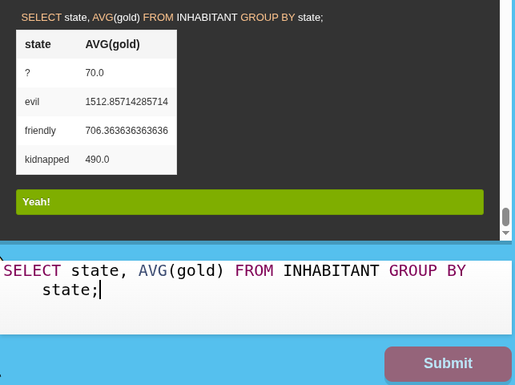

---

### **QUESTION 21:**

Or I might as well go ahead and just kill Dirty Dieter with my sword!

**Solution 21:**

```sql
DELETE FROM inhabitant WHERE name = 'Dirty Dieter';
```

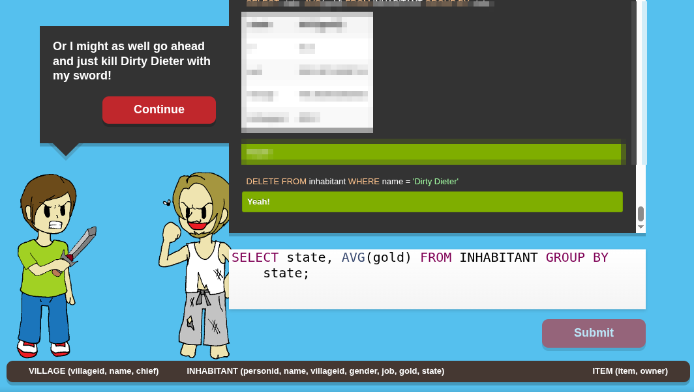

---

### **QUESTION 22:**

Heeeey! Now I'm very angry! What will you do next, Ahmed?

**Solution 22:**

```sql
DELETE FROM INHABITANT WHERE name = 'Dirty Diane';
```

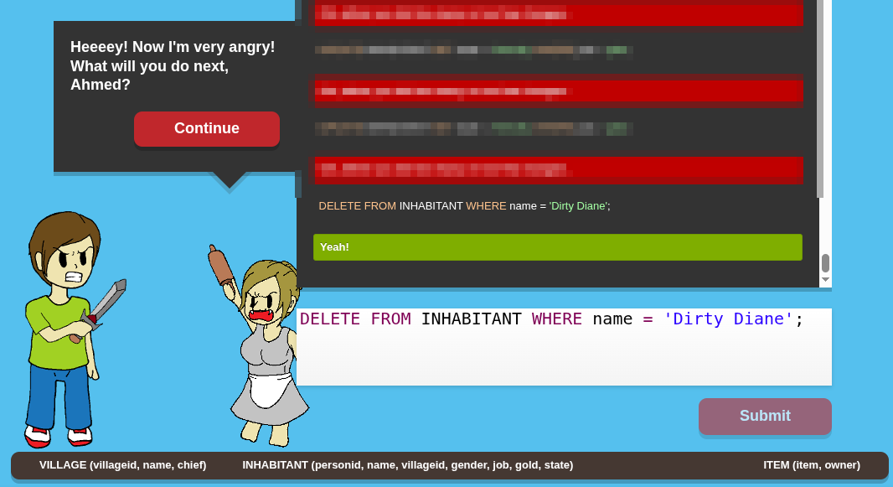

---

### **QUESTION 23:**

Yeah! Now I release the pilot!

**Solution 23:**

```sql
UPDATE INHABITANT SET state = 'friendly' WHERE job = 'pilot';
```

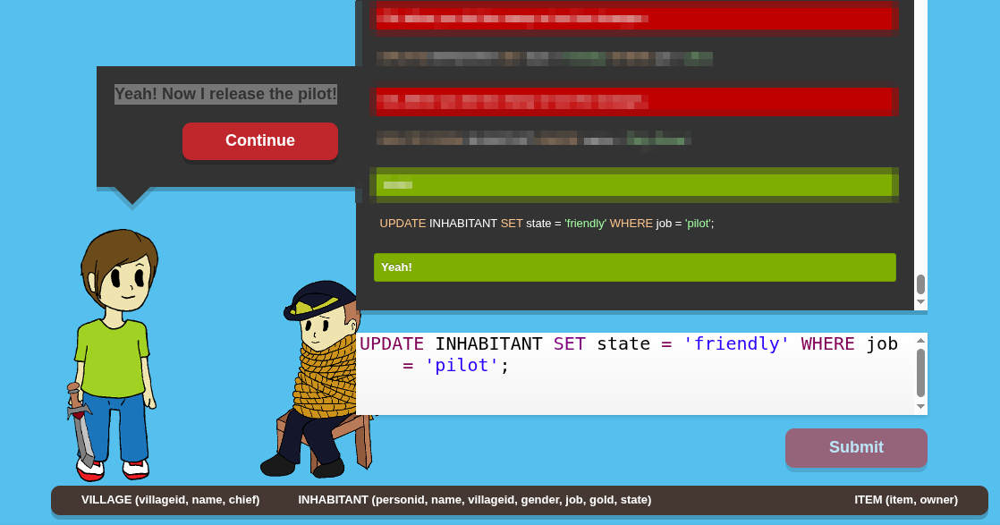

---

### **QUESTION 24:**

The game is over. Get your certificate of completion now! If you want to change the name on the certificate, use an UPDATE command on the inhabitants table.

**Solution 24:**

```sql
UPDATE INHABITANT SET name = 'Your Name' WHERE personid = 20;
```

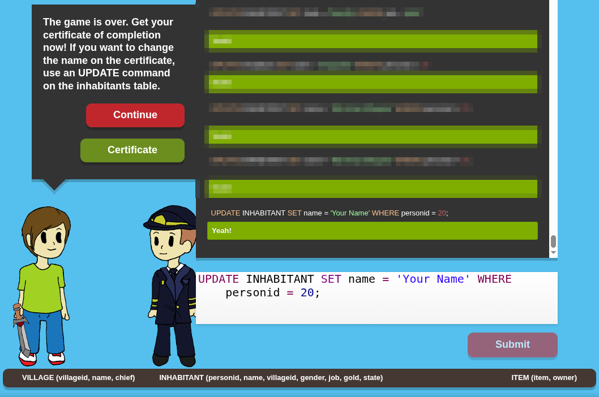

---

## 🏆 Mission Accomplished!

After navigating through the challenges of **SQL Island**, rescuing the pilot, and taking down Dirty Dieter, I have successfully earned my certificate!

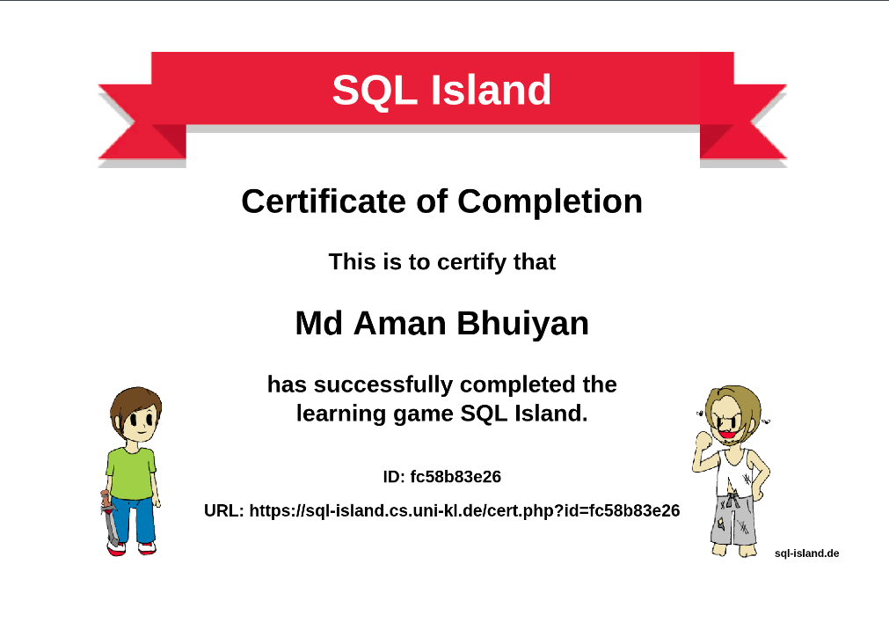

> **"Mastering SQL is the first step to conquering any data-driven world."**

Thank you for following along with my journey!
